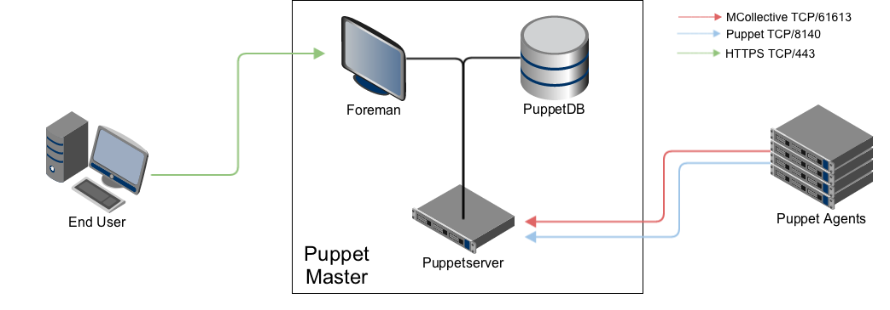

!SLIDE smbullets small

# Monolithic Installation

~~~SECTION:handouts~~~

Notes:

All communications, unless otherwise specified, are SSL encrypted.

Even when starting small, it's smart to plan for expansion by configuring dns_alt_names. This is a list of aliases which the master's SSL certificate will also validate for. This is useful when you want to place a pool of many Puppet masters behind a load balancer and share a single DNS name.

~~~ENDSECTION~~~

!SLIDE smbullets small

# Standalone Master

* Puppet Master (Port 8140):
 * Catalog and CA requests from agents.

* Foreman (Port 443):
 * Serves the Console user interface.

* MCollective (Port 61613):
 * MCollective orchestration messages.
