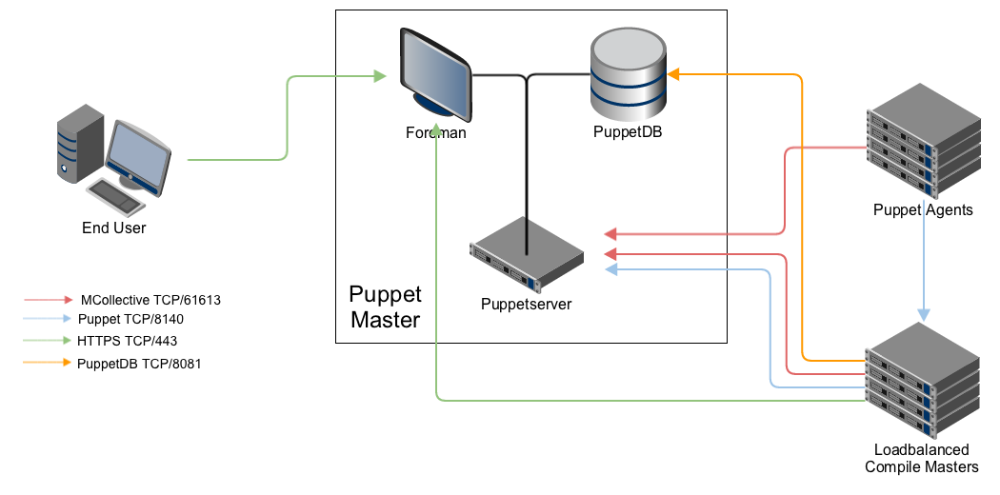

!SLIDE smbullets small

# Monolithic Installation with Compile Masters

~~~SECTION:handouts~~~

Notes:

All communications, unless otherwise specified, are SSL encrypted. In this diagram, the Master of Masters is the same configuration as the standalone master and holds the authoritative Puppet codebase.

~~~ENDSECTION~~~

!SLIDE smbullets small

# Compile Master

* Puppet Master (Port 8140):
 * Catalog requests from agents.
* PuppetDB (Port 8081):
 * Every compile master stores facts, catalog etc. into it.

Load-balanced compile masters must share a common DNS name, configured with Puppet's setting.

~~~SECTION:handouts~~~

Notes:

The Master of Masters serves as the CA node and the authoritative codebase source. Each of the compile masters must sync that codebase and forward CA requests to the CA on the Master of Masters.

~~~ENDSECTION~~~
