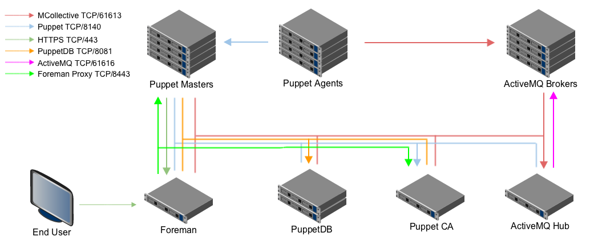

!SLIDE smbullets small

# Large Environment Installation

~~~SECTION:handouts~~~

Notes:

A load balancer of some sort is required between the agents and the compile masters. In this diagram, the compile masters are the same as described previously. All communications, unless otherwise specified, are SSL encrypted.

~~~ENDSECTION~~~

!SLIDE smbullets small

# CA and Master of Masters Node

* Puppet Master (Port 8140):
 * Inbound traffic from Puppet agents.
* Puppet CA (Port 8140):
 * Certificate request traffic.
* Master and CA (Port 8443):
 * Forman manages environments on the masters and certificates on the CA.

~~~SECTION:handouts~~~

Configuration:

* Global Puppet configuration file:
 * `/etc/puppetlabs/puppet/puppet.conf`
* Puppet Master
 * `/etc/puppetlabs/puppetserver`
 * All files in this directory are combined to generate the configuration.
* MCollective Client (sends orchestration commands from an administrative user)
 * `~/.mcollective`
* MCollective Server (listens for orchestration commands on all nodes)
 * `/etc/puppetlabs/mcollective/*`

~~~ENDSECTION~~~

!SLIDE smbullets small

# Foreman Node

* Foreman (Port 443):
 * Serves the user interface.
 * External Node Classifier for masters.

~~~SECTION:handouts~~~

Configuration:

* Foreman
 * `/etc/foreman`
* Whitelist to use ENC
 * Settings in the GUI, section auth

~~~ENDSECTION~~~

!SLIDE smbullets small

# PuppetDB Node

* PuppetDB (Port 8081)
 * Stores catalog, facts, etc.
 * Foreman manages nodes, optional plugin is needed.
* PuppetDB (Port 8080)
 * Unencrypted traffic to display the PuppetDB dashboard.
* PostgreSQL (Port 5432)
 * Backend for PuppetDB
 * Foreman database

~~~SECTION:handouts~~~

Configuration:

* PuppetDB:
 *`/etc/puppetlabs/puppetdb/conf.d`
 * All files in this directory are combined to generate the configuration.
* Certificate Whitelist
 * `/etc/puppetlabs/puppetdb/certificate-whitelist`

~~~ENDSECTION~~~

!SLIDE smbullets small

# ActiveMQ Hub

* MCollective (Port 61613)
 * MCollective orchestration messages.
* ActiveMQ (Port 61616)
 * ActiveMQ hub & spoke coordination messages.

~~~SECTION:handouts~~~

Configuration:

* ActiveMQ
 * `/etc/activemq/*`
* MCollective Server (listens for orchestration commands on all nodes)
 * `/etc/puppetlabs/mcollect/*`

~~~ENDSECTION~~~
