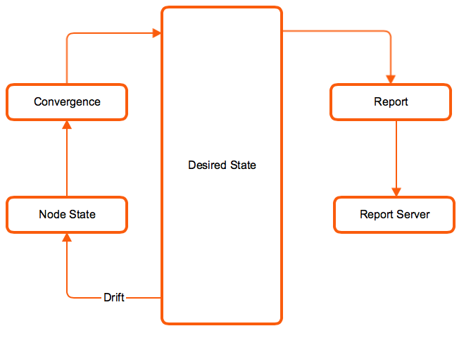

!SLIDE smbullets small

# Processing Reports

The Puppet Agent can send a report to the Puppet Master after every puppet run

!SLIDE smbullets small

# What's in a Report?

Basic Example:

    info: Applying configuration version '1328975856'
    Notice: /Stage[main]/Main/File[/tmp/foo]/mode: 
       mode changed '0444' to '0644'
    notice: Finished catalog run in 0.03 seconds

* Metadata about the node, its environment and Puppet version, and the catalog used in the run
* The status of every resource
* Actions that Puppet took during the run, also called events
* Log messages that were generated during the run
* Metrics about the run, such as its duration and how many resources were in a given state

!SLIDE smbullets small

# Configuring Reporting Processor

On the Puppet Agent:

    @@@ Sh
    $ vim /etc/puppetlabs/puppet/puppet.conf
    [agent]
        report = true

On the Puppet Master:

    @@@ Sh
    $ vim /etc/puppetlabs/puppet/puppet.conf
    [master]
        reports = https,tagmail,store,log
        reportdir = /var/lib/puppet/reports
        reporturl = http://localhost:3000/reports/upload

~~~SECTION:notes~~~

There are more report processors available, even third party ones. At the end of this training students will configure a report processor that sends reports to Logstash / Elastic Stack.

~~~ENDSECTION~~~

!SLIDE smbullets small

# Store Report Processor

* Stores report data on the Puppet Master as YAML in the `reportdir` setting
* Available for external processing by custom tooling
* Default report processor
* Reports collect quickly, perform some maintenance on them:

    <pre>
    tidy { '/var/lib/puppet/reports':
      age     => '30d',
      matches => "*.yaml",
      recurse => true,
      rmdirs  => false,
      type    => ctime,
    }
    </pre>

!SLIDE smbullets small
# Log Report Processor

    @@@ Puppet
    $ tail -f /var/log/puppet/puppetserver/puppetserver.log
    Compiled catalog for training.puppetlabs.vm in 0.86 seconds
    Caching catalog for training.puppetlabs.vm
    Applying configuration version '1328977795'
    Hello World!
    (/Notify[example]/message) defined 'message' as 'Hello World!'
    Finished catalog run in 0.69 seconds

* Contains every log message in a transaction
* Can be used to centralize client logs into syslog
* Uses the system syslog calls

!SLIDE smbullets small

# HTTP  Report Processor

* Send reports via HTTP or HTTPS
* Submits reports as POST requests to the address in the `reporturl` setting
* Body is the YAML dump of a Puppet::Transaction::Report object
* Content-Type is set as `application/x-yaml`

!SLIDE smbullets
# Lab ~~~SECTION:MAJOR~~~.~~~SECTION:MINOR~~~: Sending Reports to Foreman

* Objective:
 * Configure your master to send reports to Foreman.
* Steps:
 * Download and install the report processor.
 * Configure the master to send reports to foreman.

!SLIDE supplemental exercises
# Lab ~~~SECTION:MAJOR~~~.~~~SECTION:MINOR~~~: Sending Reports to Foreman

## Objective:

****

* Configure your master to send reports to Foreman.

## Steps:

****

* Download and install the report processor.
* Configure the master to send reports to foreman.

!SLIDE supplemental solutions
# Lab ~~~SECTION:MAJOR~~~.~~~SECTION:MINOR~~~: Sending Reports to Foreman

****

## Configure your master to send reports to Foreman.

****

Install the report processor:

    @@@ Sh
    $ curl -O https://raw.githubusercontent.com/theforeman/puppet-foreman/master/files/foreman-report_v2.rb
    $ install -m644 foreman-report_v2.rb  /opt/puppetlabs/puppet/lib/ruby/vendor_ruby/puppet/reports/foreman.rb

Configure your Puppet Master to send reports to Foreman:

    @@@ Sh
    $ vim /etc/puppetlabs/puppet/puppet.conf
    [master]
      reports = foreman

After restarting your Puppet Master, do a puppet run on your agent machine:

    @@@ Sh
    $ puppet agent -t

And control the log on your Puppet Master:

    @@@ Sh
    $ tail -f /var/log/puppetlabs/puppetserver/puppetserver.log
    ... INFO  [...] [puppetserver] Puppet 'store_report' command for yourname-agent.localdomain ...
