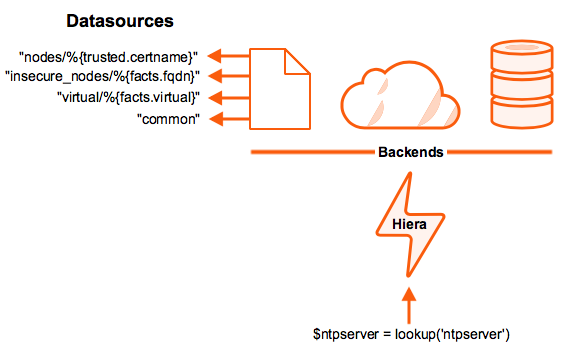

!SLIDE smbullets small

# Extend Puppet Functionality

Plugins in Puppet modules are distributed as needed across the infrastructure.

    @@@ Sh
    $ cat modules/examle
    example
    └── lib
        ├── facter
        │ └── user_count.rb
        ├── hiera
        │ └── backend
        │     └── mssql_backend.rb
        └── puppet
            ├── parser
            │   └── functions
            │       └── capitalize.rb
            ├── provider
            │   └── user_homedir
            │       └── default.rb
            ├── reports
            │   └── logstash.rb
            └── type
                └── user_homedir.rb

~~~SECTION:handouts~~~

Notes:

Distribution is triggered as the first part of each Puppet run. This means that after new plugins are installed on the master it should be synced by running its agent.

Modules would not conflate plugins of such varying functionality into a single module. Each module should cover only a single topic.

Available extension points:

* Augeas lenses can teach Puppet to manage settings within more file types.
* Facts can expose information about agent nodes.
* Functions can extend functionality of the language.
* Types and providers can allow Puppet to manage more resource types.
* Hiera backends can retrieve data from other data sources.
* Report processors can act on report data or forward them to other services.
* Puppet faces can add custom Puppet subcommands.

~~~ENDSECTION~~~

!SLIDE smbullets small

# Custom Facts

Expose information about agent nodes.

    @@@ Sh
    $ tree modules/example
    └── lib
        ├── facter
        │ └── role.rb

    # role.rb
    Facter.add('load_average') do
      setcode do
        Facter::Core::Execution.exec('uptime').split(':').last.chomp end
      end
    end

* The fact is set to the value returned from the setcode block.
* Run any commands or Ruby code.
* Errors and empty strings are intercepted and discarded.
* Reminder: all facts are executed each time the Agent runs.

!SLIDE smbullets small

# External Facts

Structured Data:

    @@@ Sh
    $ cat /etc/puppetlabs/facter/facts.d/datacenter.json
    {
      "location": "nuremberg",
      "cluster": "web"
    }

Plain Text:

    @@@ Sh
    $ cat /etc/puppetlabs/facter/facts.d/datacenter.txt
    location=nuremberg
    cluster=web

Executable Scripts:

    @@@ Sh
    $ cat /etc/puppetlabs/facter/facts.d/load_avarage.sh
    #!/bin/bash
    VALUE=$(uptime | awk '{print $(NF-2), $(NF-1), $NF}')
    echo "load_average=${VALUE}"

~~~SECTION:handouts~~~

Notes:

Notes:
Text or structured data facts are often static files are often written during the provisioning process and exist throughout the lifetime of the node. YAML and JSON are supported.
As of Puppet 3.4 and Facter 2.0.1, external facts became pluginsynced from $module/facts.d.

Windows agents support executable external facts with the following extensions:

* binary executables: .com and .exe
* batch scripts: .bat and .com
* PowerShell scripts: .ps1

~~~ENDSECTION~~~

!SLIDE smbullets small

# Hiera Data Lookup Engine

Single source of information.

~~~SECTION:handouts~~~

Notes:

Hiera allows you to store configuration data outside of your code. Each data item is stored exactly once and simply referenced wherever it is needed. This means that if you update that single source that it will propagate across your infrastructure as needed.
As a side benefit, it makes your Puppet code exponentially more readable.

~~~ENDSECTION~~~

!SLIDE smbullets small

# Three layers of hierachies

Since Puppet 4.9 hiera is full integrated in Puppet and no longer an own project.

* Global
 * Config file: $confdir/hiera.yaml (hiera_config in puppet.conf)
 * Supports hiera.yaml v5 and v3 (deprecated)
* Environment
 * Config file: <ENVIRONMENT DIR>/hiera.yaml
 * Supports hiera.yaml v5 and v4 (deprecated)
* Module
 * Config file: <MODULE>/hiera.yaml
 * Supports v5 and v4 (deprecated)
 * Only used for namespace lookup keys (i.e. ntp::servers)

~~~ENDSECTION~~~

!SLIDE smbullets small

# Sample hiera.yaml v5

    @@@ Sh
    ---
    version: 5
    defaults:
      datadir: data
      data_hash: yaml_data

    hierarchy:
      - name: "Per-node data"
        path: "nodes/%{trusted.certname}.json"
        data_hash: jason_data
      - name: "Per-network secret data (encrypted)"
        lookup_key: eyaml_lookup_key
        path: "secrets/%{facts.domain}.eyaml"
        options:
          pkcs7_private_key: /etc/eyaml/private_key.pkcs7.pem
          pkcs7_public_key:  /etc/eyaml/public_key.pkcs7.pem
      - name: "Other YAML hierarchy levels"
        paths:
          - "locations/%{facts.domain}.yaml"
          - "os/%{facts.osfamily}.yaml"
          - "common.yaml"

~~~ENDSECTION~~~

!SLIDE smbullets
# Lab ~~~SECTION:MAJOR~~~.~~~SECTION:MINOR~~~: Extend Hiera

* Objective:
 * Store Secrets in Hiera.
* Steps:
 * Install the Hiera backend.
 * Create encrypted datasources.
 * Retrieve decrypted values from your new backend.

!SLIDE supplemental exercises
# Lab ~~~SECTION:MAJOR~~~.~~~SECTION:MINOR~~~: Extend Hiera

## Objective:

****

* Store Secrets in Hiera.

## Steps:

****

* Install the Hiera backend.
* Create encrypted datasources.
* Retrieve decrypted values from your new backend.

!SLIDE supplemental solutions
# Lab ~~~SECTION:MAJOR~~~.~~~SECTION:MINOR~~~: Extend Hiera

****

### Store Secrets in Hiera.

****

Install hiera-eyaml ruby gem on your master and agent

    @@@ Sh
    $ sudo /opt/puppetlabs/puppet/bin/gem install hiera-eyaml

Add a hiera.yaml to your working directory

    @@@ Sh
    $ cat ~/puppetcode/hiera.yaml
    ---
    version: 5
    defaults:
      datadir: data
      data_hash: yaml_data

    hierarchy:
      - name: "Secret data (encrypted)"
        lookup_key: eyaml_lookup_key
        path: "secrets.eyaml"
        options:
          pkcs7_private_key: keys/private_key.pkcs7.pem
          pkcs7_public_key:  keys/public_key.pkcs7.pem
      - name: "Other YAML hierarchy levels"
        paths:
          - "common.yaml"

Create a key pair

    @@@ Sh
    $ cd ~/puppetcode
    $ /opt/puppetlabs/puppet/bin/eyaml createkeys
    $ chmod g+r keys/private_key.pkcs7.pem

    That will create a directory ./keys and store the key pair inside.
    Read permission on the private key is needed because the puppetserver
    has to read this key. Note: The deployment will be done via r10k.

Store a secret password

    @@@ Sh
    $ /opt/puppetlabs/puppet/bin/eyaml edit ~/data/secrets.eyaml
    ---
    password: DEC::PKCS7[strenggeheim]!

Commit and push your new hiera data to your master

    @@@ Sh
    $ git add .
    $ git commit -m 'add new hiera backend for eyaml'
    $ git push origin master

Test the new backend on your master

    @@@ Sh
    $ puppet apply -e 'notice(lookup(password))'
