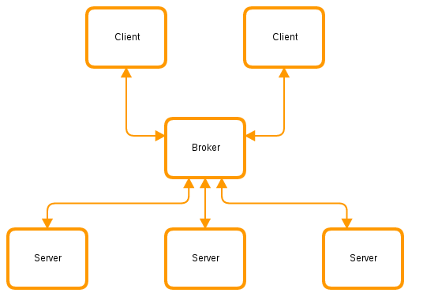

!SLIDE subsection
# ~~~SECTION:MAJOR~~~ Orchestration

!SLIDE smbullets small

# Functionality

Benefits you can achieve with orchestration:

* Invoke predefined actions in parallel across any number of nodes.
* Simple to use command line tools to call remote agents.
* Built-in agents for common functionality:
 * Interact with common resources.
 * Manage packages and services.
 * Control Puppet.
* Eliminate complex naming conventions for hostnames as a means of identity.
* Produce custom reports about your infrastructure.
* A framework to build custom orchestration tools and interfaces.

!SLIDE smbullets small

# MCollective

The Puppet all-in-one package brings MCollective for orchestration

* Framework for orchestration
* Needs Message broker for communication (middleware)
 * Servers (on managed nodes) subscribe to topics
 * Clients (for Admins) post messages to queues/topics
 * Broker stores and ships messages
 * Single instance or network of brokers
* Several brokers are supported
 * ActiveMQ (default)
 * RabbitMQ
 
~~~SECTION:handouts~~~

There is a third party repository for ActiveMQ on RHEL/CentOS: 

    @@@ Puppet
    yumrepo { "activemq":
      name => 'lkiesow-apache-activemq-dist',
      baseurl => 'https://copr-be.cloud.fedoraproject.org/results/lkiesow/apache-activemq-dist/epel-7-$basearch/',
      descr => 'Copr repo for apache-activemq-dist owned by lkiesow',
      skip_if_unavailable => true,
      enabled => true,
      gpgcheck => true,
      gpgkey => 'https://copr-be.cloud.fedoraproject.org/results/lkiesow/apache-activemq-dist/pubkey.gpg',
    }

~~~ENDSECTION~~~

!SLIDE smbullets small

# Middleware Terminology

* Middleware:       A publish subscribe based system like Apache ActiveMQ.
* Middleware        Broker: A message queuing bus that transmits messages between peers.
* Middleware Topic: Messages sent to a topic are received by all subscribers.
* Subscriber:       Consumes messages from a topic.
* Publisher:        Writes messages to a topic.

!SLIDE

# Broker Architecture

~~~SECTION:notes~~~

Keep in mind that "server" is the software that runs on the orchestrated hosts.

~~~ENDSECTION~~~

!SLIDE smbullets

# Component Terminology

* Server
 * Application server for Agents and broker connections
 * On every host, managed or admin workstation
* Agent
 * Runs on server
 * Ruby code for a set of specific tasks
 * Control Puppet, manage packages, manage services, etc.
* Action
 * Task provided by Agent
 * e.g. `start`, `stop`, `status` of Service
* Application
 * MCollective plugin
 * Sends messages to Agents
