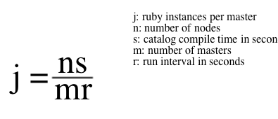

!SLIDE smbullets small

# Tuning Puppetserver JVM

    @@@ Sh
    $ vim /etc/sysconfig/puppetserver
    ...
    JAVA_ARGS="-Xms2G -Xmx2G -XX:MaxPermSize=256m"

    $ vim /etc/puppetlabs/puppetserver/conf.d/puppetserver.conf
    jruby-puppet: {
      ...
      # (optional) maximum number of JRuby instances to allow
      max-active-instances: 2

      # (optional) maximum number of requests per JRuby instance
      max-requests-per-instance: 100
    }

~~~SECTION:handouts~~~

Note:

Defaults:

* Number of jRuby instances:
 * number of CPUs - 1, with maximum of 2
* JVM Heap size
 * 2gb, enough for 4 average sized jRuby instances.

~~~ENDSECTION~~~

!SLIDE smbullets small

# Estimating jRuby instances required

This formula assumes an even temporal load with no surges. As such, it's a theoretical estimate only and no replacement for actual benchmarking.

* Estimate parameter for a given load.
* Should not exceed one less than the number of processors.
* On average, a jRuby instance consumes roughly 512mb of memory.
* JVM heap must be adjusted to accommodate if you exceed 4 jRuby instances.

~~~SECTION:notes~~~

Using gigantic hosts as puppetserver is not as useful as it seems to be. Restarting the puppetserver means restarting all jRuby instances. Using too many of those instances results in service restart times over 10 minutes.

~~~ENDSECTION~~~

!SLIDE smbullets small

# Rules of Thumb

* JVM OutOfMemory errors:
 * JVM shutdown with stacktrace.
 * Logged in corresponding application's logfile.
 * jRuby instances have grown too large for JVM heap.
 * Resolution: increase heap or decrease jRuby instances.
* System error:
 * JVM killed by kernel.
 * Logged via syslog.
 * Heap has grown too large for system RAM.
 * Resolution: decrease heap size and jRuby instances.

You’ll also want to allocate a little extra heap to be used by the rest of the things going on in Puppet Server: the web server, etc. So, a good rule of thumb might be 512MB + (max-active-instances * 512MB).

!SLIDE smbullets small

# Environment Caching

Disk read speed vs. memory usage.

* Puppetserver caches codebase.
 * All code in environment is cached.
 * Code is cached as compiler loads it.
 * Not read from disk again until cache expiration.
 * Can use a lot of memory for large or numerous environments!
* Set unlimited cache to increase performance.
 * Must expire cache each time code is deployed.
 * `environment_timeout = unlimite`
* Disable cache to lower memory usage
 * `environment_timeout = 0`

~~~SECTION:handouts~~~

Notes:

environment_timeout is a Puppet configuration setting that can go in or in an individual environment's environment.conf.

Tip: The Node Classifier will periodically request a list of all classes in all environments from the master. This means that each jRuby that has ever serviced that request will have the full codebase for each environment cached in memory.
In a master-of-masters configuration, the toplevel master-of-masters is the only node servicing this request. In this configuration, it's often useful to configure this master with only one or two jRuby instances and a large amount of heap to minimize the memory usage and to minimize the number of times that a jRuby instance must be started cold and load the entire codebase at once.

~~~ENDSECTION~~~

!SLIDE smbullets small

# Linux System Settings

Resource limits can affect compilation.

* System setting controls process resource limits.
* Increase the number of file handles the Master can have open at any time.
* Configured per user.

  <pre>
  $ vim /etc/security/limits.d/30-puppet.conf
  puppet  hard  nofile      65535
  </pre>
