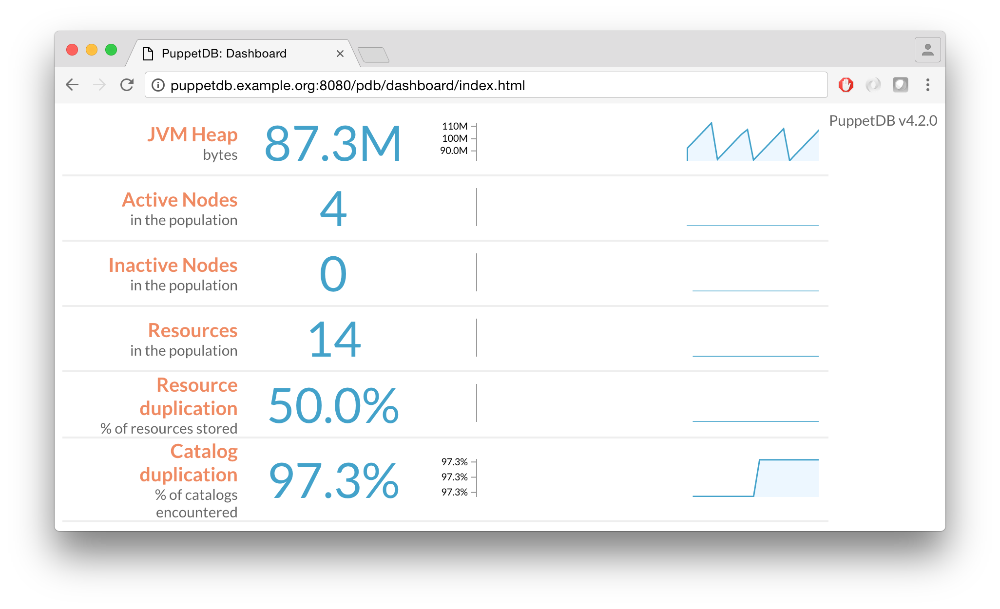

!SLIDE smbullets small

# Tuning PuppetDB

* Gigantic reports can cause memory exhaustion.
* Normally only seen when managing many thousands of resources.
* Symptoms:
 * Successful agent runs are marked as unresponsive.
 * PuppetDB Command Queue increases.
 * PuppetDB DLO Size on Disk increases.
* Default heap size is 192mb.
 * Configure with JAVA_ARGS in `/etc/sysconfig/puppetdb`.
* Set threads to use for command processing:
 * Option threads in `/etc/puppetlabs/puppetdb/conf.d/config.ini`.

~~~SECTION:handouts~~~

Notes:

https://docs.puppetlabs.com/puppetdb/latest/maintain_and_tune.html

~~~ENDSECTION~~~

!SLIDE smbullets small

# PuppetDB Dashboard

* Enable dashboard by setting to listen on 0.0.0.0:
 * Option host in `/etc/puppetlabs/puppetdb/conf.d/jetty.ini`.
* http://puppetdb.example.org:8080

