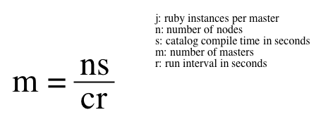

!SLIDE smbullets small

# Recommended Baseline

Puppetserver running on the JVM

* Roughly 500 nodes.
* Check-in time set to 30 mins with a 5 min splay (default).
* Hardware requirements:
 * 4 core processor
 * 16 GBs of RAM

!SLIDE smbullets small

# Thundering Herd

When many nodes check at once.

* Caused by unevenly distributed node check-in times.
* Large groups of nodes using a random splay may converge on certain times.
 * Side effect of using a pseudo random number.
* Sometimes alleviated by running Agent as a cron job.
 * Disable the Puppet Agent service.
 * Use `fqdn_rand()` to randomize checkin time.

In example implementated as puppet cron resource:

    @@@ Code
    $first_run = fqdn_rand(30)
    $second_run = fqdn_rand(30) + 30

    cron { 'cron.puppet':
      command => "/opt/puppetlabs/bin/puppet agent -t > \
          /dev/null", user => "root",
      minute => [ $first_run, $second_run ],
    }

~~~SECTION:handouts~~~

Note:

fqdn_rand() will generate a predictable random number. In other words, the distribution of output is random, but it will always generate the same random number for a given node, based on its fully qualified domain name.

~~~ENDSECTION~~~

!SLIDE smbullets small

# When to Scale

* Watch agent run reports:
 * Run times will spike by orders of magnitude.
 * Timeouts when retrieving catalogs.
* Monitor server metrics:
 * top, atop and friends
 * CPU utilization stays at 100% for a significant period.
  * Indicates overloaded master.
 * Some cores maxed but others unloaded.
  * Indicates insufficient number of jRuby instances.
 * Count number of compiles in master logs.
  * Should see almost exactly nodes * checkins/h compiles.
 * Use third party tools to monitor metrics

~~~SECTION:handouts~~~

Notes:

The total number of compilations happening across all nodes should be almost exactly equal to the number of nodes in your infrastructure multiplied by the expected number of runs per hour. If significantly fewer compiles occur, then the master is overloaded and is not able to keep up.
For example, if you have 1000 nodes, and you've left the set at its default of 30 minutes, then you should see a total of 2000 catalogs compiled across all of your compile masters.
This is an empirical form of the simple formula we use to predict the number of masters that will be required for a given workload.

This is a simple Bash script that can count the number of catalog compiles occurring on a compile master each hour for the current day.

    @@@ Code
    #! /bin/sh
    LOG='/var/log/puppetlabs/puppetserver/puppetserver.log'
    DATE=$(date +"%Y-%m-%d")
    NOW=$(date +%H)
    for i in $(seq 0 ${NOW})
    do
      num=$(printf "%02d" $i)
      echo -n "${DATE} ${num}: "
      grep 'Compiled catalog' ${LOG} | grep "${DATE} ${num}:" | wc -l
    done

~~~ENDSECTION~~~

~~~SECTION:notes~~~

Third party tools like Logstash / Elastic Stack will be discussed later. Other options like Graphite or Icinga 2 with Graphite might be added to the training later.

~~~ENDSECTION~~~

!SLIDE smbullets small

# Estimating Requirements

Based on catalog compile time:

* Helps spec infrastructure design and hardware purchasing.
* Calculates theoretical minimum number of masters for a given load.
* Assumes dedicated servers.

~~~SECTION:handouts~~~

Notes:

This is a rough estimate only and should be taken as a starting point. Round up to the next whole number and benchmark some Puppet runs. Make sure to account for variability and spikes in load.

~~~ENDSECTION~~~

!SLIDE smbullets
# Lab ~~~SECTION:MAJOR~~~.~~~SECTION:MINOR~~~: Estimating Capacity

* Objective:
 * Estimate how many Puppet Masters you will need to support your infrastructure.

!SLIDE supplemental exercises
# Lab ~~~SECTION:MAJOR~~~.~~~SECTION:MINOR~~~: Estimating Capacity

## Objective:

****

* Estimate how many Puppet Masters you will need to support your infrastructure.

!SLIDE supplemental solutions
# Lab ~~~SECTION:MAJOR~~~.~~~SECTION:MINOR~~~: Estimating Capacity

****

## Estimate how many Puppet Masters you will need to support your infrastructure.

****

Solutions not required.
