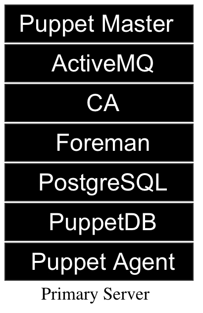
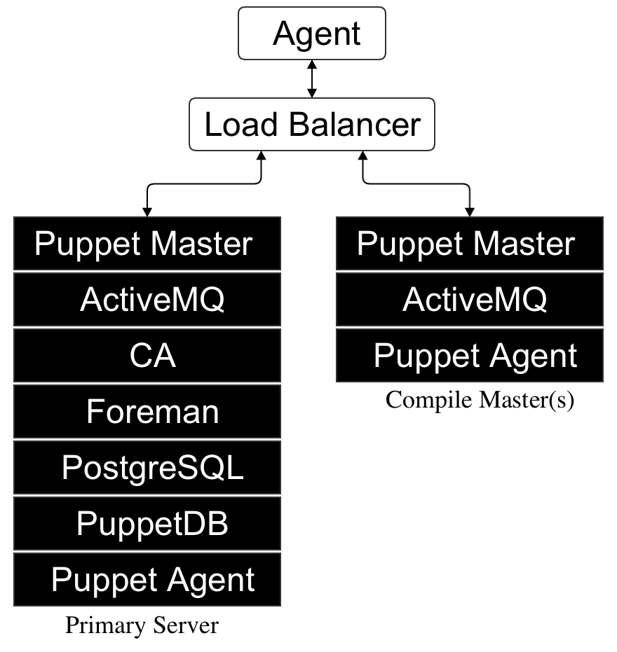
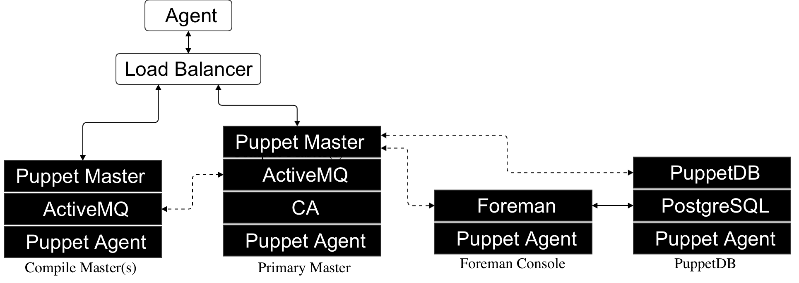

!SLIDE smbullets small

# Recommended Architectures

Choice of layout depends greatly on catalog complexity.

* Small scale:
 * Up to 500 nodes.
* Medium scale with compile masters:
 * Approximately 1500 nodes per additional compile master.
* Large scale:
 * Up to 7000 nodes.

An infrastructure supporting more than 7000 nodes is considered Extra Large and may require custom architecture design.

!SLIDE smbullets small

# Small Scale Architecture

~~~SECTION:handouts~~~

Notes:

Small Scale:

* Single all-in-one server.
* Puppet Enterprise default install.
* Up to 500-800 nodes.

~~~ENDSECTION~~~

!SLIDE smbullets small

# Medium Scale Architecture

~~~SECTION:handouts~~~

Notes:

Medium Scale:

* Two or more masters behind a load balancer.
* Similar to the classroom layout.
* Supports approximately 1500 nodes per additional compile master.

~~~ENDSECTION~~~

!SLIDE smbullets small

# Configuring Compile Masters

* A pool of Masters behind a load balancer.

Each compile master must have a dns_alt_names setting that matches the DNS name of the load balancer so that SSL certificates validate when the agent requests a catalog from the load balancer and is connected to any one of the compile masters.

!SLIDE smbullets small

# One Shared CA for all Multiple Masters

One Puppet Master is designated as the ca_server.

* One CA signs all certificates.
* All agents and all masters trust each other.
* Allows agents to request a catalog from any master with a signed certificate.

!SLIDE smbullets small

# Load Balancing

Using HAProxy as an example.

* HAProxy is a software defined load balancer for TCP & HTTP.
* Puppet modules use exported resources to autoconfigure clustered services.

!SLIDE smbullets small

# Load Balancing

Export a resource from each compile master:

    @@@ Code
    node /^compile\d+.localdomain$/ {
      @@haproxy::balancermember { "puppet_${::fqdn}":
        listening_service => 'puppet00',
        server_names      => $::hostname,
        ipaddresses       => $::ipaddress,
        ports             => '8140',
        options           => 'check',
      }
    }

Collect resources on load balancer to build records for each:

    @@@ Code
    node 'proxy.localdomain' {
      include haproxy
      haproxy::listen { 'puppet00':
        ipaddress => $::ipaddress,
        ports     => '8140',
      }
      Haproxy::Balancermember <<| listening_service == 'puppet00' |>>
    }

!SLIDE smbullets small

# Large Scale Architecture

Split Installation with compile master(s):

~~~SECTION:handouts~~~

Notes:

Large scale:

* Split install with multiple compile nodes behind a load balancer.
* Separate ActiveMQ hub & spoke nodes, as covered in the Orchestration section.
* Tested with 7000 nodes and three compile masters.

~~~ENDSECTION~~~
